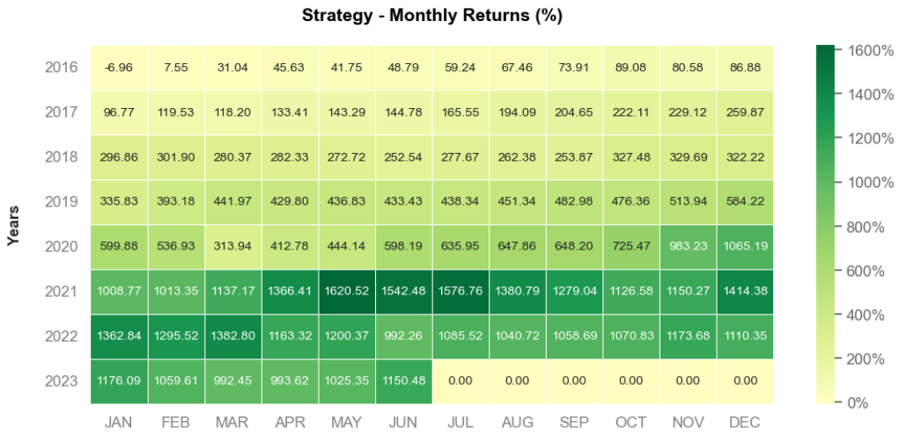
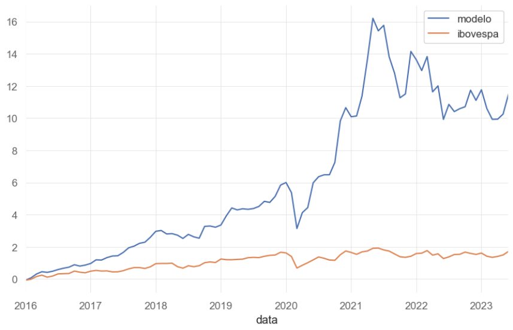
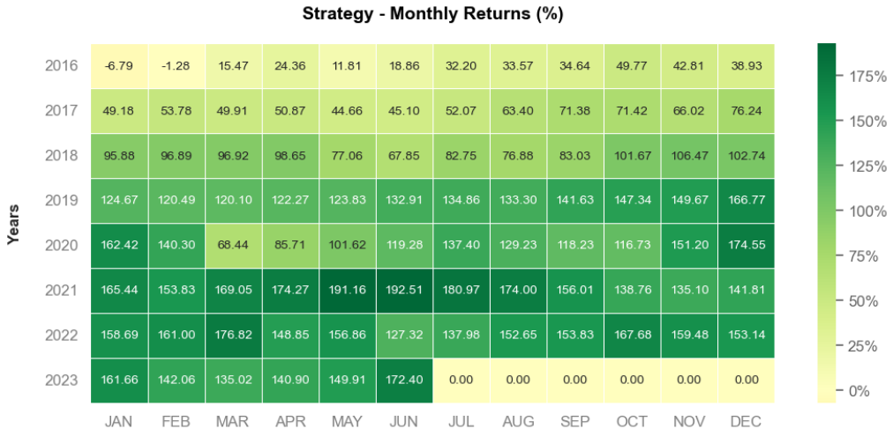

<!DOCTYPE html>
<html>

<body>
  <h1>Análise de Dados e Backtesting de Modelo de Investimentos com Python</h1>
  
Este projeto consiste em uma análise de dados e um backtesting de um modelo de investimentos desenvolvido em Python. O objetivo principal é extrair informações das empresas listadas na B3 (a bolsa de valores brasileira) através de web scraping, avaliar o desempenho financeiro delas e conduzir um backtesting comparativo com o Ibovespa, o benchmark das ações negociadas na B3.

  <h2>Pré-requisitos</h2>
  
Certifique-se de ter as bibliotecas webdriver e Pandas instaladas em seu ambiente Python. Você pode fazer a instalação das mesmas usando o gerenciador de pacotes pip e digitando <code>!pip install (nome do pacote)</code>

  <h2>Execução</h2>
  <ul>
    <li>Clone este repositório para o seu computador.</li>
    <li>Abra o arquivo projeto.ipynb em um ambiente Jupyter Notebook.</li>
    <li>Execute as células sequencialmente para reproduzir a análise e o backtesting.</li>
  </ul>

  <h2>Resultados</h2>
  
Os resultados da análise financeira e do backtesting podem ser encontrados no próprio notebook. Os gráficos de desempenho comparativo estão incluídos, proporcionando uma avaliação visual da estratégia em relação ao desempenho geral do mercado.

  
  <h2>Gráficos Comparativos</h2> 
   <h3 ><strong>Heatmap Modelo</strong></h3>
        
    <h3><strong>Modelo x Ibovespa</strong> </h3>
        
    <h3><strong>Heatmap Ibovespa</strong> </h3>
    
    
 <h2>Estratégia</h2>
  <h3>EV/EBIT (Enterprise Value to Earnings Before Interest and Taxes)</h3>
    
O EV/EBIT é uma métrica que compara o valor da empresa (considerando dívida e caixa) ao seu lucro antes de juros e impostos.

    
O objetivo é encontrar empresas que estejam sendo negociadas a um preço relativamente baixo em relação ao seu lucro operacional. Um baixo valor de EV/EBIT pode indicar que a empresa está subavaliada em relação à sua capacidade de gerar lucros.

  <h3>ROIC (Return on Invested Capital)</h3>
  
O ROIC é uma métrica que avalia a eficiência da alocação de capital de uma empresa. Ele mede o retorno gerado em relação ao capital investido na empresa, incluindo dívida e patrimônio líquido. Empresas com um alto ROIC geralmente são capazes de gerar lucros consistentes e eficientes em relação ao capital investido.

  
  <h3>Etapas</h3>
  <ul>
    <li><strong>Ranking:</strong> Primeiro, as ações são classificadas com base no valor do EV/EBIT, com as ações de menor valor de EV/EBIT recebendo uma classificação mais alta.  </li>
    <li><strong>Ranking do ROIC:</strong> Em seguida, as ações são classificadas com base no valor do ROIC, com as ações de maior valor de ROIC recebendo uma classificação mais alta.  </li>
    <li><strong>Soma dos Rankings:</strong> Os rankings do EV/EBIT e ROIC são somados para cada ação. Quanto mais baixa a soma dos rankings, melhor a posição da ação.  </li>
    <li><strong>Seleção das Ações:</strong> As ações com as somas de rankings mais baixas são consideradas as melhores opções de investimento, pois combinam um baixo EV/EBIT (indicativo de preço atrativo) com um alto ROIC (indicativo de eficiência na alocação de capital).  </li>
  </ul>

  <h2>Contribuição</h2>
  
Contribuições são bem-vindas! Se você deseja melhorar ou expandir este projeto, fique à vontade para abrir um pull request.

  
  
</body>

</html>
